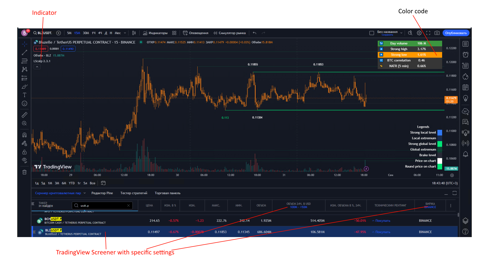

# Scalping level screener

The screener analyzes horizontal levels on cryptocurrency charts and sends notifications to Telegram.

Cryptocurrency screener consists of a server part and an indicator for tradingView. The server part is a console application
which launches chrome browser and interacts with it using selenium library. The data storage is
local database LiteDB.

The principle of operation is as follows: the console application opens a browser, goes to the tradingView site and cycles through the coins filtered in the "cryptocurrency pairs screener" panel.
pre-filtered in the "cryptocurrency pairs screener" panel. There is an indicator on the chart, which uses colors to indicate to the application that the price is approaching a price level.
indicates to the application that the price is approaching horizontal levels. The application takes a screenshot for each instrument and 
analyzes this screenshot for the presence of color coding in the indicator table. Based on this analysis, a decision is made
decision on notification in Telegram.



> *Note:* the default settings for the screenshot analyzer are set to 1920x1080 screen resolution

## Useful

Send a message to telegram via http request:
```https://api.telegram.org/bot000000000:DDE9eIjdIxc2jdPxxxxx_XXXXXXXXXXXXX/sendMessage?chat_id=chat_name_or_id&text=test```